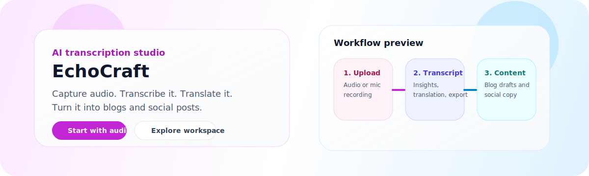
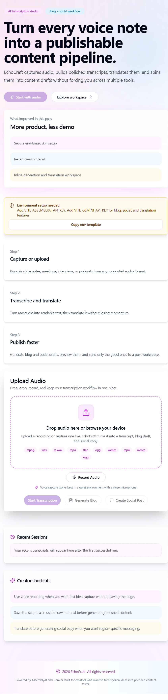

# EchoCraft

EchoCraft is an AI-powered creator workspace that turns voice notes and audio uploads into polished transcripts, translations, blog drafts, and social-ready copy.





speech-to-text transcription content-creation content-generator blog-generator social-media translation multilingual generative-ai gemini creator-tools audio-processing voice-notes reactjs typescript vite tailwindcss frontend shadcn-ui assemblyai

## Why EchoCraft

- Convert spoken ideas into structured written content fast.
- Translate transcripts for multilingual publishing workflows.
- Generate blog and social drafts inside the same workspace.
- Keep a cleaner creator flow from audio capture to final copy.

## Visual Preview


## Features

- **Speech-to-Text Conversion**: Transcribe spoken words into text using the AssemblyAI API.
- **Content Creation**: Generate blog drafts and social-ready copy directly from transcripts.
- **Multilingual Support**: Translate transcriptions into other languages seamlessly.
- **Modern UI/UX**: Built with React, TypeScript, Tailwind CSS, and shadcn/ui for a responsive and animated interface.
- **Session Recall**: Revisit recent transcript sessions from local history.
- **Export Tools**: Copy, download, and export transcript content for downstream use.

## Tech Stack

- **Frontend**: React.js, TypeScript, Tailwind CSS, shadcn/ui, Vite
- **APIs**:
  - [AssemblyAI API](https://www.assemblyai.com) for speech-to-text conversion
   - [Google Gemini API](https://ai.google.dev/) for content generation and translation

## Installation

1. Clone the repository:
   ```bash
   git clone https://github.com/AniruddhaAdak/echocraft.git
   cd echocraft
   ```

2. Install dependencies:
   ```bash
   npm install
   ```

3. Add your API keys:
   - Create a `.env` file in the project root and add the following:
     ```env
     VITE_ASSEMBLYAI_API_KEY=your_assemblyai_api_key
     VITE_GEMINI_API_KEY=your_gemini_api_key
     ```

4. Start the development server:
   ```bash
   npm run dev
   ```

## Usage

1. Record or upload audio to transcribe speech into text.
2. Review the generated transcript, insights, and exports.
3. Translate the transcript when you need a different audience language.
4. Generate blog drafts or social media content from the same workspace.
5. Open the post workspace to refine, copy, share, or download generated content.

## Discoverability Topics

The repository is tagged with these GitHub topics:

`assemblyai` `speech-to-text` `transcription` `content-creation` `content-generator` `blog-generator` `social-media` `translation` `multilingual` `generative-ai` `gemini` `creator-tools` `audio-processing` `voice-notes` `reactjs` `typescript` `vite` `tailwindcss` `frontend` `shadcn-ui`

## Contribution

Contributions are welcome! Feel free to open issues or submit pull requests.

## Daily Automation

This repository includes a scheduled GitHub Actions workflow at `.github/workflows/daily-maintenance-pr.yml`.

- It runs every day and can also be triggered manually from the Actions tab.
- It installs dependencies, runs `npm run lint`, runs `npm run build`, and generates a dated report in `docs/daily-reports/`.
- It opens a pull request instead of pushing directly to `main`, which keeps the automation reviewable.

If you want to change the schedule, edit the `cron` entry in the workflow file.

## License

This project is licensed under the MIT License. See the [LICENSE](LICENSE) file for details.

## Contact

For queries or feedback, contact:
- **Email**: [aniruddhaadak80@gmail.com](mailto:aniruddhaadak80@gmail.com)
- **GitHub**: [GitHub Profile](https://github.com/AniruddhaAdak)

---
